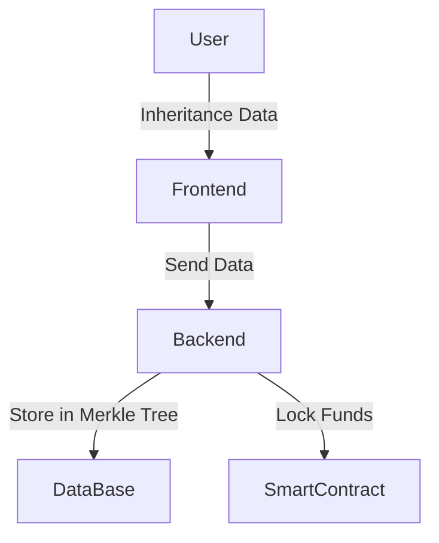
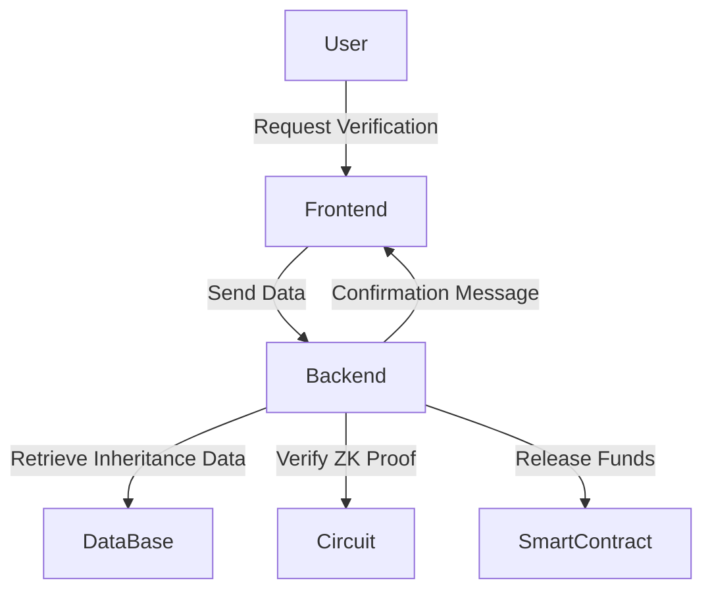

# **Inheritance Smart Contract Project Documentation**

## **Introduction**
The Inheritance Smart Contract project is a decentralized solution that ensures secure inheritance transfers on the blockchain. By utilizing zero-knowledge proofs (ZKPs), a Merkle Tree structure, and smart contracts deployed on the Arbitrum network, this system allows users to securely create, verify, and claim inheritance without exposing sensitive information.

This document outlines the architecture, functionalities, and interaction flow between the frontend, backend, circuit verification, and smart contract.

---

## **1. System Architecture**
The project consists of four primary components:

1. **Frontend**: User interface for creating, verifying, and claiming inheritance.
2. **Backend**: Manages data, handles verification, and interacts with the blockchain.
3. **Circuits**: Zero-knowledge proof verification to ensure data integrity.
4. **Smart Contract**: Handles funds locking, verification, and distribution.

### **Technology Stack**
- **Frontend**: Svelte, typescript, node.js
- **Backend**: Node, smart contracts which verify proof and done transactions
- **Database**: JSON-based storage for off-chain data / future: NFT on EduChain and datebase instead json
- **Smart Contracts**: Solidity (Arbitrum Network) / future:Rust (Arbitrum Stylus)
- **Zero-Knowledge Proofs**: Circom, groth16, ZkVerify
- **AI**: EduChain
---

## **2. Features**
### **Creating an Inheritance**
- Users enter inheritance data (heirs, funds, and assets).
- Backend generates a Merkle Tree with the inheritance data.
- Smart contract locks the required funds.
- Data is stored in an encrypted off-chain database.

### **Reading an Inheritance**
- Users verify their identity using ZK proofs ZkVerify.
- Backend queries the database to fetch inheritance details.
- The zero-knowledge circuit verifies that the user is an eligible heir.
- Once verified, the smart contract releases the locked funds and assets.

### **Security Measures**
- **ZK Proofs**: Ensures no sensitive data is revealed during verification.
- **Merkle Tree Structure**: Provides efficient data integrity and verification.
- **Smart Contract Safeguards**: Prevents unauthorized withdrawals and ensures fair distribution.

---

## **3. Interaction Flow**
### **1. Creating Inheritance**

1. User inputs inheritance details in the frontend.
2. The frontend sends the data to the backend.
3. The backend stores the hashed inheritance data in a Merkle Tree.
4. The backend locks funds in the smart contract corresponding to the inheritance.

### **2. Reading & Claiming Inheritance**


1. User requests inheritance verification.
2. The backend retrieves the stored data.
3. The circuit verifies the legitimacy of the claim using a ZK proof.
4. The smart contract releases the locked funds/assets to the rightful heir.
5. The frontend displays a success confirmation.

---


## **4. Frontend Workflow**

### **User Actions:**
- **Connect Wallet**: User connects their crypto wallet.
- **Enter Passport Data**: User inputs hashed passport data.
- **Choose Action**:
  - **Create Testament**: Enter heirs' data, assign lawyer, specify inheritance details.
  - **Read Testament**: Fetch stored JSON and convert it to PDF for display.
- **Lawyer Approval**:
  - Lawyer enters verification data.
  - Lawyer confirms user's passing and activates the testament.
- **Claim Inheritance**:
  - Heir verifies identity with ZK proof.
  - Backend retrieves testament details.
  - Smart contract releases assets upon successful verification.

---


## **5. Smart Contract Functions**
### **Structs**
```solidity
struct Heir {
    address heirAddress;
    uint256 percentage;
    string documentHash;
}

struct Testament {
    address owner;
    address lawyer;
    bool isActive;
    Heir[] heirs;
}
```

### **Key Functions**
```solidity
function createTestament(address _lawyer) external returns (uint256);
function addHeir(uint256 _testamentId, address _heir, uint256 _percentage, string memory _documentHash) external;
function activateTestament(uint256 _testamentId) external;
function viewInheritance(uint256 _testamentId) external view returns (uint256, string memory);
function claimInheritance(uint256 _testamentId) external;
```
- **`createTestament()`** - Creates a new testament.
- **`addHeir()`** - Adds heirs to the testament.
- **`activateTestament()`** - Lawyer activates the testament upon the owner's death.
- **`viewInheritance()`** - Allows heirs to view their share before activation.
- **`claimInheritance()`** - Releases inheritance funds upon activation.

---


---
## **6.zkMerkle Testament Verification Flow**

### Overview
The zkMerkle Testament Verification process leverages zero-knowledge proofs (ZK) and Merkle trees to securely handle inheritance transactions upon the testator's death. This ensures that only authorized individuals can claim their inheritance without revealing sensitive information about other beneficiaries.

### Testament Creation
When a person (testator) creates a testament, the following steps are executed:
1. Identity Hashing: Each beneficiary's identity information is hashed. Typically, this can be a combination of their personal details (e.g., name, ID number, or public key).
2. Merkle Tree Construction: These hashed identities serve as the leaves of a Merkle tree. Each leaf represents a beneficiary, and the position in the tree corresponds to their unique identity hash.
3. Merkle Root Registration: The Merkle root, representing the entire set of beneficiaries, is stored on-chain as part of the testament record.

### Testament Verification and Fund Transfer
When a beneficiary attempts to claim their inheritance, the following process is performed:
1. Proof Generation:
    - The claimant submits their identity details, which are hashed in the same way as during the testament creation phase.
    - A Merkle proof (path from the leaf to the root) is generated using their position in the Merkle tree.
    - A ZK proof is created, demonstrating that the claimant's identity is included in the Merkle tree without revealing other beneficiaries.

2. Zero-Knowledge Verification:
    - The ZK proof and the Merkle root are submitted on-chain.
    - The smart contract verifies the proof using a zkVerify function.
    - If the proof is valid, it confirms that the claimant is part of the testament.

3. Fund Transfer:
    - Upon successful verification, the smart contract executes the inheritance distribution.
    - The specified amount of funds is transferred to the claimant's address.

### Security and Privacy
- Beneficiaries' identities remain confidential as only the hash and ZK proof are revealed.
- The ZK proof prevents unauthorized claims while ensuring only legitimate beneficiaries receive their inheritance.
- The Merkle tree structure guarantees efficient proof generation and verification even with a large number of beneficiaries.

### Key Functions
- hashIdentity(data): Hashes the beneficiary's identity.
- generateMerkleProof(leaf, tree): Generates a Merkle proof for a given identity hash.
- zkVerify(proof, root): Verifies that the proof is valid against the stored Merkle root.
- distributeFunds(beneficiary, amount): Transfers the inheritance to the verified beneficiary.

This zkMerkle approach ensures trustless, private, and secure inheritance execution on-chain.

---

## **7. Security Considerations**
- **Unauthorized Access Prevention**: Only the designated lawyer can activate the testament.
- **Immutability**: Testament data cannot be altered once finalized.
- **On-Chain Proofs**: Ensures the legitimacy of heir claims.
- **Circuit Verification**: Prevents fraudulent claims.

---

## **8. Future Enhancements**

- **Upgrade Rust Contract**: Improve the existing Rust contract and compare its efficiency against the Solidity smart contract.
- **NFT-Based Asset Representation**: Tokenizing physical assets in inheritance on **EDUchain** as NFTs containing all relevant information.
- **AI Integration**: Implement AI-based support for asset distribution and provide an advisory system.
- **Conditional Activation**: Enable additional conditions for contract activation (e.g., reaching age 18, getting married, etc.).
- **Multi-Sig Authentication**: Allowing multiple legal entities to approve testament activation.

---

## **9. Conclusion**
The Inheritance Smart Contract project ensures secure and verifiable asset transfer on the blockchain. By leveraging zero-knowledge proofs, a Merkle Tree structure, and smart contract automation, it eliminates intermediaries while maintaining full privacy and security. Future enhancements aim to further optimize the process and expand its functionalities.


